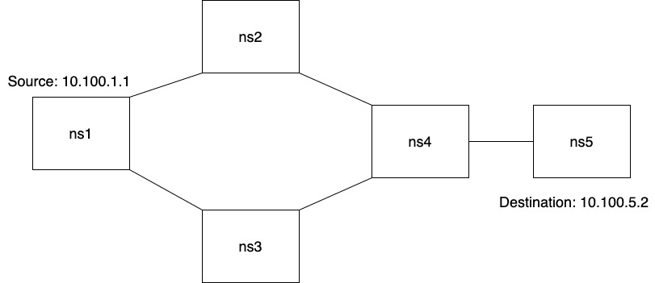
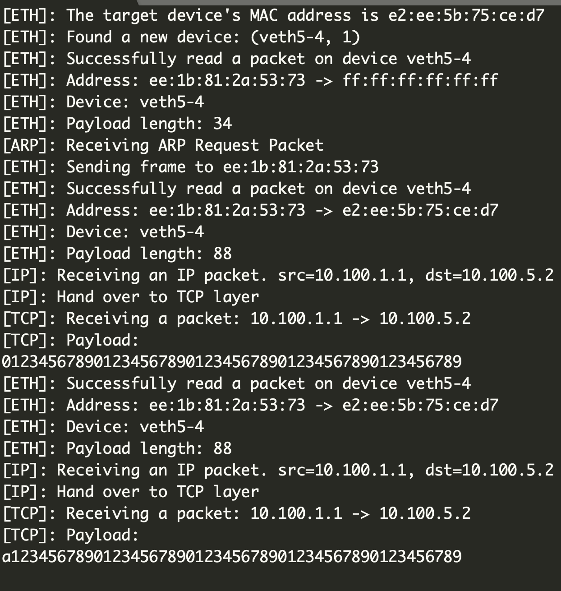

# Codelists

### How to build

We build our program using cmake. Install cmake if you have not yet install it.

To build the program, simply run:

```shell
cmake CMakeLists.txt
make
```


## Link Layer Implementation

- `./include/common.h` Some type definitions and utility functions.

- `./include/kernel.h`: The simulated kernel protocol stack. A `kernel_t` stores and manages all the states of the protocol stack.

- `./include/device.h`: Device management functions. It is worth noting that when launching a device for capturing, the function `launch` instantiates **another thread** for packet capturing to avoid blocking. Currently only support single thread sniffing on each device.
- `./include/packetio.h`: Functions for sending and receiving ethernet frames. We also implement a single debugging callback function `eth_debug_callback` that prints the info of the received packets and exits immediately. The real callback function will be provided within IP layer implementation in the next submission.
- **Link Layer testings: **`./test_scripts/eth_tests.cpp`, `./test_sctipts/eth_tests2.cpp`: A simple program that perform sanity checks on addDevice, sending ethernet frames and receiving ethernet frames.
  
    - First, build the virtual network with topology same as described in `./vnetutils/README.md`. 
    
    - Then run:
    
      ```shell
      # @ns2
      cd bin
      ./eth_tests veth2-3
      ```
    
      ```shell
      # @ns3
      cd bin
      ./eth_tests2 veth3-2
      ```
    
      The program `eth_tests` will send a packet from `ns2:veth2-3` to `ns3:veth3-2`. In `result.txt` and `result2.txt` you can see the log file generated by the two programs.

- **Result** : Our implemented testing shows that our protocol supports transporting packets from one node to its neighborhood.

## IP layer Implementation

-  `./include/packetio.h`: A `default_eth_rcv_callback` function is implemented to hand over to the ARP layer or IP layer.

- `./include/arp.h`: An ARP-like protocol is implemented for both greeting and getting informations (e.g, MAC address) of the neighbor devices. This protocol does not follow the standard ARP protocol.

- `./include/ip.h`: The IP protocol and the ip flooding routing algorithm are implemented to support IP sending, forwarding and receiving, as well as routing table configuration. This protocol follows the rfc791.

- `./include/BOBHash.h`: BOBHash64, a hash function for computing the fingerprint.

- `./include/tcp.h`: A TCP debugging callback function.

**IP layer testing**: `./test_scripts/ip_tests.cpp` and `./test_scripts/ip_tests2.cpp`, where `ip_tests2.cpp` maually configure routing table of `ns1`. The topology configuration is at `./configure/example.txt`:

```

5
1 2 10.100.1
2 4 10.100.2
1 3 10.100.3
3 4 10.100.4
4 5 10.100.5

```

The topology looks like this: 

To run the test, first run vnetutils to build the virtual network, and then run the following commands (`./configure/run.txt`) respectively:

```
# ns1
./ip_tests result0.txt 0 10.100.5.2 veth1-2 veth1-3
# ns2
./ip_tests result1.txt 1 veth2-1 veth2-4
# ns3
./ip_tests result2.txt 1 veth3-1 veth3-4
# ns4
./ip_tests result3.txt 1 veth4-2 veth4-3 veth4-5
# ns5
./ip_tests result4.txt 1 veth5-4
```

The logs will be automatically recorded in `result0~4.txt`.

The output of ns5 will look like this: 



**Conclusion**: Our testing shows that our protocol stack supports transporting a packet from one host to another through a very complicated topology (like the topology described above). Our routing protocol works in arbitrary topology.

## TCP Layer Implementation

`./include/tcp.h`: The logics for the TCP layer.

`./include/socket.h`: The POSIX-like socket interface.


**TCP layer testing**: `./test_scripts/echo_client.cpp`, `./test_scripts/echo_server.cpp` use socket interface provided in `./include/socket.h` for remote echoing. The server listens at port 80 and loops forever to accept clients. The script `./test_scripts/client_run.py` launches a client around every 60 seconds and launches 10 clients in total. 

**topology**: Our topology is simple. The topology configuration is at `./configure/example_tcp.txt`:

```txt

2
1 2 10.100.1
```

That means 10.100.1.1 connects with 10.100.1.2 through a virtual wire.

In order to run the test, first build the virtual network through vnetutils. Then run the following commands in `run_tcp.txt`:

```
# In ns2, echo server:
./echo_server result2.txt veth2-1

# In ns1, echo client:
python3 client_run.py
# Or you can run manually:
./echo_client result1.txt 10.100.1.2 80 veth1-2 abcdefghigklmn
```

The results will be printed on screen and the log file will be recorded in `./result1.txt, ./result2.txt`

You can also adjust `tcp.cc:PACKET_DROP_RATE` to try how the protocol stack behaves with different loss rate.

**Conclusion**: Our end-to-end TCP protocol stack is robust even with packet loss / reordering, and our echo server is robust to loop forever to serve the clients.

