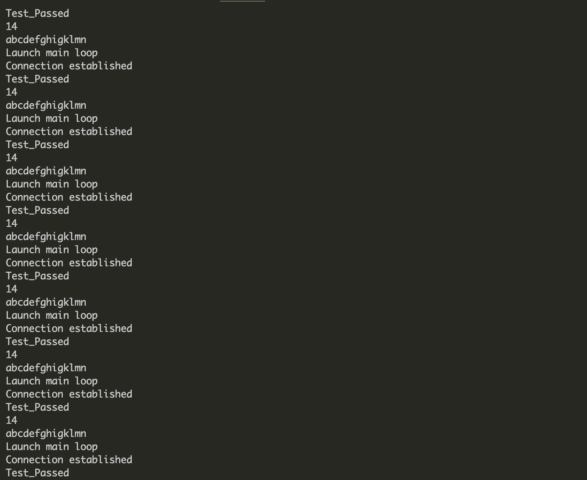
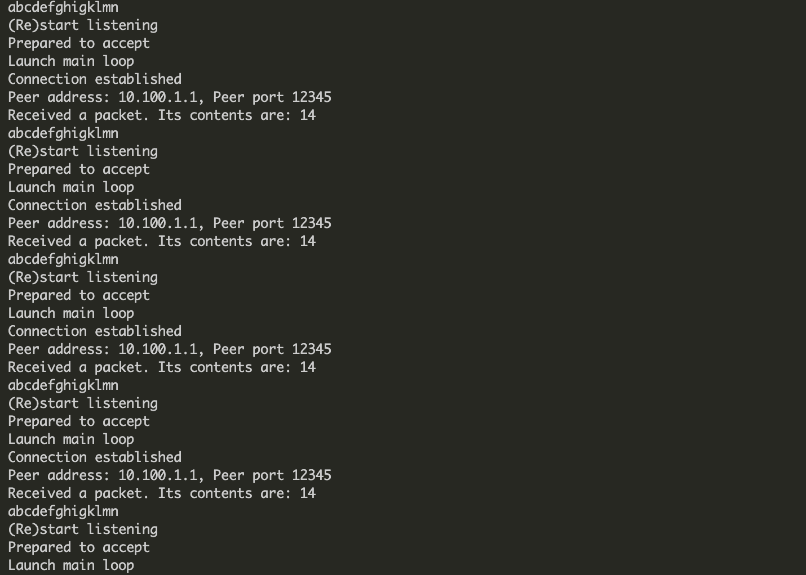

# Writing Tasks

## IP Layer

### Overview

In this part, I implemented a **reentrant** standard IP layer protocol as well as **IP flooding** routing algorithm. A protocol similar with the standard ARP protocol is implemented for both greeting and getting the information of the neighbors' MAC address.

**Feature**: Reentrant & thread-safe: we carefully add lock to all the global data structures. Each time we would like to visit the global structure, the global data structure will be locked until all the operations has been done.

### Writing Tasks

**WT2**: A protocol similar with the standard ARP protocol to discover the destination MAC address. 

- The protocol broadcast an ARP request to all the neighbor devices, and all the neighbor devices receiving this request reply it, bringing their own MAC addresses. If the sender successfully receives the ARP response, it won't repeatedly resend the ARP request within next 20 seconds. When the next IP packet comes, it simply lookup the table and use the recorded MAC addresses to forward IP packets. The ARP information will expire after 20 seconds.
- In fact, in the simplest solution, when using IP flooding as our routing algorithm,  the destination MAC address is indeed not needed and can be filled with `ff:ff:ff:ff:ff:ff`, as long as the receiver's link layer is implemented so that Ethernet Broadcast IP packets can be accepted. However, I still believe that a protocol similar with ARP protocol should be implemented. First, the ARP protocol acts like a greeting protocol, and in fact, it is a strange behaviour for the receiver to **receive an unicast IPv4-type packet with its destination mac addrress equals to ethernet broadcast address**. Second, after calling ARP protocol once, we would get the neighbor's information, and it becomes possible to choose to ignore some neighbors.

**WT3**: IP flooding is implemented as the routing algorithm. 

- Assumption: within e.g. `300ms`, layer 4 (TCP layer) does not retransmit the exact same packet -- if the TCP payload + header remains exactly the same, it will be discarded. However, this can be solved when we set the TCP timestamp field, since the TCP retransmission packet actually has a different TCP timestamp. This feature will be implemented in our TCP layer.
- Algorithm: The routing algorithm is to simply forward the IP packet to all the neighboring hosts. In order to avoid IP flooding storm, duplicated packets will simply be dropped. 
  - To achieve this, each host records a hash map that records the timestamp of all the recently visited packets. Specifically, for each packet to be forwarded, we use `BOBHash64` to calculate its whole IP payload's fingerprint. We then set `map[fingerprint]=current_time`. 
  - Upon receiving a packet, we check if there has been another packet with the same fingerprint value within 300ms. If true, the packet will simply be dropped.
  - A cleaner thread is used to release the memory for the expired entries.

**WT4**: See **WT2**. Before sending an IP packet, a protocol described in **WT2** is used to inform the neighboring hosts and as a by-product, they bring their MAC addresses back to the IP sender.

### Corner Cases

1. The Link layer helps to filter out some invalid packets. We consider a packet invalid if

- The destination MAC address does not equal to either `ff:ff:ff:ff:ff:ff` or the device's MAC address.
- The ethernet type equals to ETH_TYPE_IPV4, but the destination MAC address equals to `ff:ff:ff:ff:ff:ff`. We consider it as a strange packet and drop it.
- The ethernet type does not equal to either ETH_TYPE_IPv4 or ETH_TYPE_ARP. Other protocols are not implemented (including ipv6).

2. Upon calling ipv4_callback for either forwarding or pass-up, we check for the validicity of the packet. Specifically:

   - Length of the IP header and length of the whole packet must be correct.
   - IP checksum must equal to 0.
   - Only IPV4 is supported, and fragmented packets will be dropped.
   - If TTL = 0, simply drop it.

3. For manual routing, duplicate setting is not allowed; when multiple rules fits, we apply Longest Prefix Match (LPM) rule to choose the next hop.

   For flooding, we set 300ms as IPV4_FLOOD_TIMEOUT. Even if there is a cycle big enough such that it takes 300ms to return, it will not produce storming, and TTL will eventually become 0. Our design of flooding algorithm also use the whole IP payload as hash key. For TCP retransmission packet, our implementation of the protocol stack will set a different timestamp value to distinguish the original packet and avoid being dropped. Also, after 300ms, the exact same packet will not be dropped, since the rule will be expired.

4. For ARP, retransmission is not implemented, and when timeout, the original IP packet will be dropped.

   ARP_id is added so that out-of-order issue can be easily solved.

   It is likely that one ethernet link connects multiple destination devices: we cannot assume that the ethernet link is a one to one link. Therefore, when sending an ARP request to a device, there may be multiple ARP replies. Replies with wrong destination MAC addresses or with no corresponding IP record will be dropped. Since our ARP protocol requests for **all** the neighbor's information, when receiving a valid reply, the IP record will not be deleted until timeout.

## TCP Layer

**Overview**

In this part, I implemented a simplified TCP layer protocol as well as POSIX-like socket interface. All the POSIX socket operation is supported and can fall back to standard operations when the socket_fd does not belong to our protocol stack. The TCP layer protocol is carefully implemented with locks so that it is **reentrant** and it supports multi TCP connections (thread safe). TCP reliable transmission is supported, so that the program works well when there is packet loss / delay variation / packet reordering. Three way handshake as well as data transmission is supported, but four-way FIN TCP closing is not implemented. The transmission protocol simply applies sequential stop-and-wait algorithm (in other words, sliding window is not implemented). 

### Writing Tasks

**WT2**: 

- For each TCP connection, there are three threads managing this connection: the callback thread that accepts incoming packets, changs the TCP state machine and replys to the packets; the TCP main loop thread that retransmits packets in case of timeout and accepts new packets from socket to transmit; the "socket thread" that calling the socket interface functions. 
- TCP state change is carefully implemented to comply with RFC 793 (e.g, transmission between TCP_CLOSED, TCP_LISTEN, TCP_SYN_RCVD, TCP_SYN_SENT, TCP_ESTAB), except that TCP closing is not implemented.
  - Our protocol stack can also handle TCP state change when there is packet loss. To make our protocol stack works, packet backup as well as TCP state backup is carefully implemented. It can be proved, that in sequential stop-and-wait algorithm, it is enough to backup only one packet and one TCP state context -- the retransmission can only be the last packet and earlier packets will be ignored. Specifically, for an incoming packet, we first check for the current TCP state & the incoming packets' sequence number, ACK number, and TCP flags. Bad / outdated packets are simply dropped (e.g, duplicated ACKs are dropped; out-of-order packets, e.g, new data packet before a previous ACK packet, are dropped). After that, we check whether the new packet is a retransmission packet or not (e.g, duplicated data packet) and making correct responses. The TCP main loop also retransmit packets in case of timeout. In that sense, my implementation is robust so that TCP state change is correctly handled in case of packet loss, etc.
  - For example, the most complicated case is the "SYN-ACK -> ACK -> first packet transferred from the client chain". If the ACK packet is lost, the first data packet is implemented to be dropped by the server since the connection has not been established. The server will then send a dup SYN-ACK and it matches the tcp backup state of the client. The client will then reset its current status to the backup state (but with the first data packet kept) and resend the ACK packet. On timeout of the data packet, the client will then resend the first data packet.

**WT3**: 

- Most of the details are described in WT2. In short, we implemented the simple sequential stop-and-wait strategy. The next data packet will be transmitted only when the former packets' ACK has been received. To handle the packet loss / reordering, we check for the sequence number & ACK number & TCP flags. TCP state will be reset to the backup state if the incoming packet is a retransmission packet. With this method, data transfer from **either** side of the connection at **any** time is supported.

### Corner cases:

- Dealing with too long packet that exceeds the window size: long packet will be fragmented into several small packets to be transmitted. 
- Incoming packets are carefully checked and malformed/outdated packets will be dropped. E.g, packets with incorrect checksum, incorrect port, or seq_num/ack_num/flags inconsistent with the current TCP state will be dropped.
- Corner cases for packet loss or reordering, etc., is carefully handled, with the help of backing up TCP state and data packets. Packets will be retransmitted every 1 second. Our intensive tests show that our protocol stack can survive even the packet loss rate is as high as 50%.
- TCP connection would not loop "forever" if the peer host leave accidentally. The TCP connection will be automatically closed after 30 seconds, so that functions like `accept` and `read` returns -1 after 30 seconds.
- Locks are carefully added for thread safety: each TCP state machine can be visited by only one thread at a time, and so are other  global data structures.

## Testings

Our testing consists of three parts: ethernet layer check, IP transportation and routing check, and end-to-end TCP check. See @`./codelists.md` for the testings of the first two parts.

In IP layer testing, we have tested the correctness of IP transportation and routing in a complicated topology. For testing the TCP layer, we build a small virtual network with only a client connecting to a server through a virtual wire. We implemented an "echo client" and an "echo server" for testing our whole protocol stack.

The echo client and echo server both call our POSIX-like socket interface. The echo server loops forever for handling requests from the client. Once the connection has been built, the client sends a string: `<len>\n<str>` to the server. The server receives this packet and replies the same content back to the client. The client then check whether the replied message is the same as the sent message. To test if our server can survive to serve for client one by one (instead of serving only one client and then exiting), we implement a simple python program to set up clients one by one for the echo service.

We set packet drop rate = 30% at tcp.cc: PACKET_DROP_RATE. The following result figure shows that our TCP protocol stack is robust even with packet loss / reordering, and our echo server is robust to loop forever to serve clients.

The details of our testing can be found at `./codelists.md`.

Client:

Server:

